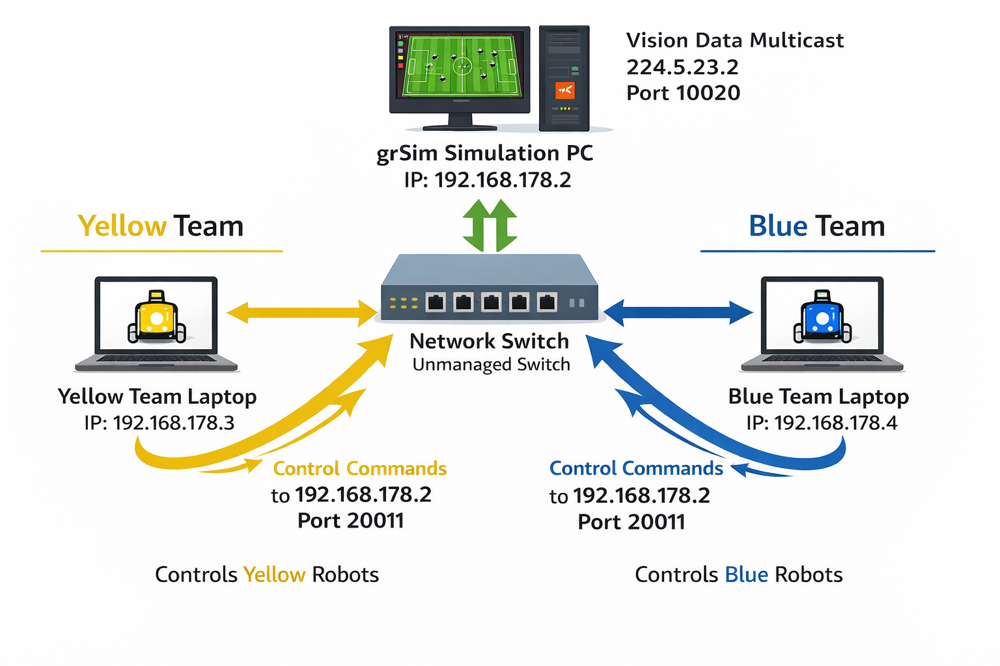
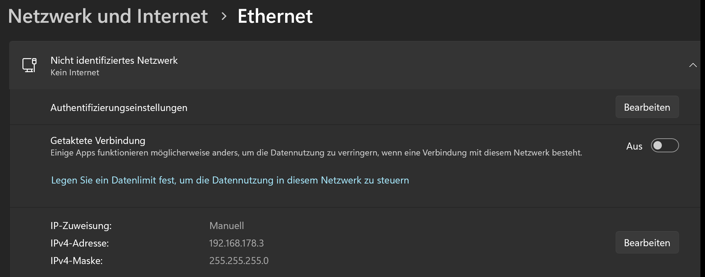
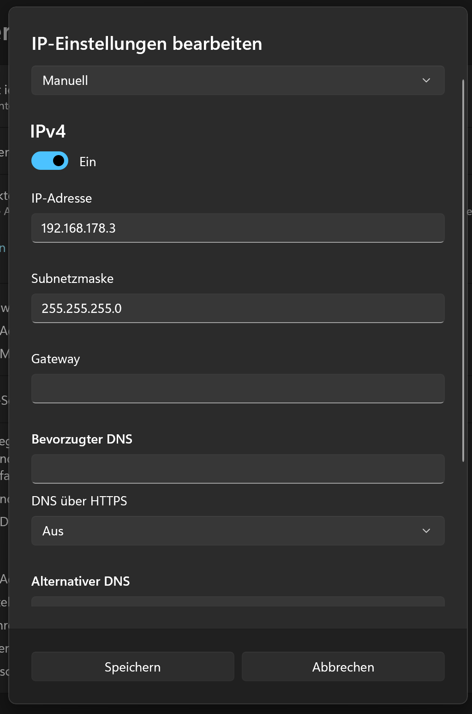
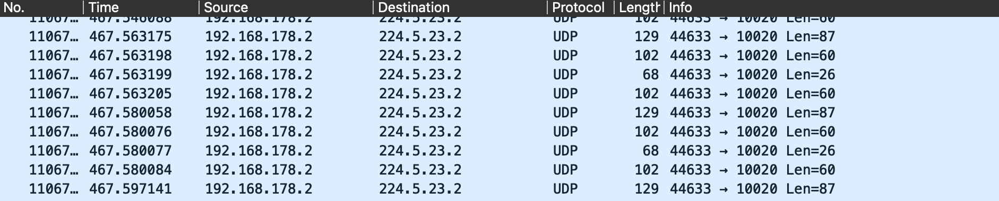
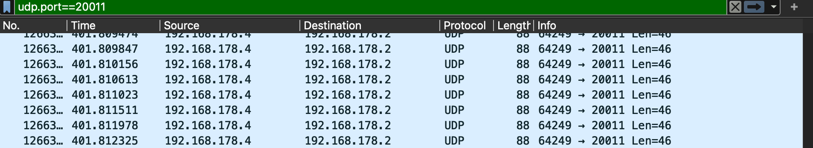

# Network Setup for the Final Competition

For the final competition and practice day, **grSim will run on a central PC provided by us**.  
Each team will connect their laptop to the **same unmanaged Ethernet switch** and run their team controller code locally.

This document explains:
- how the network is structured,
- what you need to configure on your laptop,
- how to verify that everything is working,
- and how to debug common problems.

---

## Setup Overview



### Key Points
- All devices are on the **same local network** (no router, no DHCP).
- **IP addresses are set manually**.
- grSim:
  - **receives robot commands** via UDP (port `20011`)
  - **sends vision data** via UDP multicast (`224.5.23.2`, port `10020`)
- Both teams receive the same vision data, but send commands for their own robots.

---

## Network Configuration

| Device | IP Address | Notes |
|------|-----------|------|
| grSim PC | `192.168.178.2` | Provided by us |
| Team 1 Laptop | `192.168.178.3` | Yellow team |
| Team 2 Laptop | `192.168.178.4` | Blue team |
| Netmask | `255.255.255.0` | Required for all devices |

---

## Setup Steps

### 1. Set a Static IP Address
#### Ubuntu

1. Connect your laptop to the **Ethernet switch**
2. Open **Settings → Network**
3. Click the ⚙️ icon next to **Wired**
4. Go to the **IPv4** tab
5. Set **IPv4 Method** to **Manual**
6. Add the following values:

**For Yellow Team**
- Address: `192.168.178.3`
- Netmask: `255.255.255.0`

**For Blue Team**
- Address: `192.168.178.4`
- Netmask: `255.255.255.0`

> ⚠️ Do **not** use the same IP address as another team or the grSim PC.


#### Windows
Go to your ethernet settings:

Change your IP settings to this:

<p align="center">
  
</p>

#### Mac
The approach for Mac is very similar to the two above.

---

### 2. Configure Addresses and Ports in Your Code

Previously, you ran **grSim and your controller on the same PC**, so `127.0.0.1` (localhost) worked.

Now:
- grSim runs on a **different PC**
- You must send commands to the **grSim PC IP address**

#### Vision Configuration

In `sandbox.py`, make sure the port is correct:

```python
use_sim = True
vision_port = 10020
```

#### Command Configuration
In `sandbox_process.py`, update the simulator IP and command port:
```python
SIM_IP = "192.168.178.2" #IP address of the grSim PC
CMD_LISTEN_PORT = 20011
```

#### Multicast Group (Vision)
In `src/TeamControl/network/ssl_sockets.py`, verify the multicast address in the init function of the Vision class:
```python
group: str = "224.5.23.2"
```
If you never changed this before, it should already be correct.

### 3. Turn off your Wifi
We advise you to turn off your Wi-Fi as this can hinder communication.

### Check Connection
1. **Basic Connectivity Test**
   
    From your laptop:
    ```ping 192.168.178.2```

    You should see replies from the grSim PC. If not, there is probably an issue with either your network or the grSim PC's network.

1. **Check Sending Movement Commands**
  
    You can test command sending in two ways.

    *Option A*: **Using the grSim client**

    Settings for the grSim client:
   - Simulator Address: 192.168.178.2
   - Simulator Port: 20011
  
    Try moving a robot by setting a robot id, some velocity then click "Connect" and "Send".

    *Option B*: **Using your code**

    Run your sandbox process (e.g. ball following).

If command sending works:
- Robots move in grSim
- Even if vision is broken, robots should still move (but behavior will be random)

If robots do not move:
- This is not a vision problem
- This might be because your firewall is blocking outgoing UDP packets or the firewall of the grSim PC is blocking incoming UDP packets. 


### Troubleshooting
Useful Debugging Commands for Ubuntu

#### Network Basics
Show your IP address:
```hostname -I```

Show interfaces:
```ip link show```

Show interface details:
```ip addr show <interface-name>```

#### Firewall
Disable firewall (recommended for the competition):
```sudo ufw disable```
Enable again:
```sudo ufw enable```

#### Multicast Debugging
Enable multicast on an interface:
```sudo ip link set dev <interface-name> multicast on```

Add a multicast route:
```sudo ip route add 224.0.0.0/4 dev <interface-name>```

Verify multicast routing:
```ip route get 224.5.23.2```

Show multicast group memberships:
```ip maddr show <interface-name>```

#### UDP Packet Inspection
Check if vision packets arrive:
```sudo tcpdump -i <interface-name> udp port 10020```

Listen on all interfaces:
```sudo tcpdump -i any udp port 10020```

Check outgoing command packets:
```sudo tcpdump -i <interface-name> udp port 20011```

#### Using Wireshark (Optional)
1) Open Wireshark
2) Select your Ethernet interface
3) Apply a filter:
    * Only multicast ethernet frames: "eth.dst contains 01:00:5e"
    * Only vision multicast: "udp.port == 10020"
      You should see something like this when you receive vision packets:
      
    * Only command packets: "udp.port == 20011"
      You should see something like this when you are running your code:
      


### Known Problems and Solutions
#### Robots Do Not Move in grSim
- Cause: Firewall blocking UDP packets
- Fix: `sudo ufw disable`

#### grSim Error Message: “Sending UDP datagram failed”
- Cause: No multicast route
- Fix: Open a route `sudo ip route add 224.0.0.0/4 dev <interface-name>`. Then restart grSim.

#### Vision Data Not Received, But Movement Commands Work
Go to `src/TeamControl/network/receiver.py` and change this section:

```python
def _add_group(self):
        """adds group to multicast socket"""
        self.is_ready = False
        mreq = struct.pack("=4sl", socket.inet_aton(self.group), socket.INADDR_ANY)
        self.sock.setsockopt(socket.IPPROTO_IP, socket.IP_ADD_MEMBERSHIP, mreq)
        self.is_ready = True
```

To this:

```python
def _add_group(self):
        """adds group to multicast socket"""
        self.is_ready = False
        user_device_interface_ip = "192.168.178.3" # or whatever your IP address is
        mreq = struct.pack("=4s4s", socket.inet_aton(self.group), socket.inet_aton(user_device_interface_ip))
        self.sock.setsockopt(socket.IPPROTO_IP, socket.IP_ADD_MEMBERSHIP, mreq)
        self.is_ready = True
```